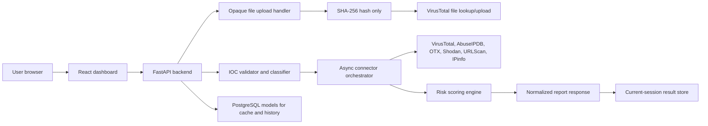

# Architecture

The dashboard is split into a React frontend and a FastAPI backend. The frontend
never talks directly to threat intelligence providers. All provider API keys live
only in backend environment variables or a deployment secret manager.

## Security Boundaries

- The backend validates and classifies every IOC before cache, database, or API work.
- Private, loopback, link-local, multicast, and metadata IPs are blocked by default.
- Current-session reports can be fetched by analysis ID after an analysis completes.
- Database access is modeled through SQLAlchemy ORM classes for future persistent cache and history.
- Uploaded files are handled as opaque byte streams. The backend hashes the
  bytes, checks VirusTotal by SHA-256 first, and does not execute, import,
  unzip, unpack, or write the sample to disk.
- The frontend renders plain React text and does not use raw HTML injection.
- Rate limits, request body size checks, CORS, and security headers are installed in the API.
